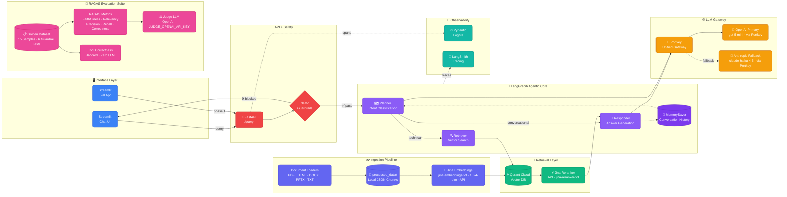

# AegisRAG : LangGraph · Guardrails · LLM Gateway · RAGAS Evals

```mermaid
graph LR

    %% ── Interfaces ───────────────────────────────────────────────────────────
    subgraph UI ["🖥️  Interface Layer"]
        direction TB
        CHAT["Streamlit\nChat UI"]
        EVAL_UI["Streamlit\nEval App"]
    end

    %% ── API + Safety ─────────────────────────────────────────────────────────
    subgraph SAFETY ["  API + Safety"]
        direction TB
        API["⚡ FastAPI\n/query"]
        GR{"NeMo\nGuardrails"}
    end

    %% ── LangGraph Agent ──────────────────────────────────────────────────────
    subgraph AGENT ["🧠  LangGraph Agentic Core"]
        direction TB
        PL["🗺️ Planner\nIntent Classification"]
        RT["🔍 Retriever\nVector Search"]
        RS["💬 Responder\nAnswer Generation"]
        MEM[("💾 MemorySaver\nConversation History")]
    end

    %% ── Retrieval ────────────────────────────────────────────────────────────
    subgraph RETRIEVAL ["🔎  Retrieval Layer"]
        direction TB
        QD[("🗄️ Qdrant Cloud\nVector DB")]
        FR["⚡ Jina Reranker\nAPI · jina-reranker-v3"]
    end

    %% ── LLM Gateway ──────────────────────────────────────────────────────────
    subgraph GATEWAY ["🌐  LLM Gateway"]
        direction TB
        PK["🔀 Portkey\nUnified Gateway"]
        G1["🤖 OpenAI Primary\ngpt-5-mini · via Portkey"]
        G2["🤖 Anthropic Fallback\nclaude-haiku-4-5 · via Portkey"]
    end

    %% ── Ingestion ────────────────────────────────────────────────────────────
    subgraph INGEST ["📥  Ingestion Pipeline"]
        direction TB
        LOADER["Document Loaders\nPDF · HTML · DOCX · PPTX · TXT"]
        PARSED[("📁 processed_data/\nLocal JSON Chunks")]
        EMB["🔢 Jina Embeddings\njina-embeddings-v3 · 1024-dim · API"]
    end

    %% ── Observability ────────────────────────────────────────────────────────
    subgraph OBS ["📡  Observability"]
        direction LR
        LF["🔥 Pydantic\nLogfire"]
        LS["🦜 LangSmith\nTracing"]
    end

    %% ── Evals ────────────────────────────────────────────────────────────────
    subgraph EVALS ["🧪  RAGAS Evaluation Suite"]
        direction LR
        GD[("📋 Golden Dataset\n15 Samples · 6 Guardrail Tests")]
        RAGAS["RAGAS Metrics\nFaithfulness · Relevancy\nPrecision · Recall · Correctness"]
        TC["Tool Correctness\nJaccard · Zero LLM"]
        JUDGE["⚖️ Judge LLM\nOpenAI · JUDGE_OPENAI_API_KEY"]
    end

    %% ── Main Query Flow ──────────────────────────────────────────────────────
    CHAT -->|query| API
    API --> GR
    GR -->|"❌ blocked"| CHAT
    GR -->|"✅ pass"| PL
    PL -->|conversational| RS
    PL -->|technical| RT
    RT --> QD
    QD --> FR
    FR --> RS
    RS --> PK
    PL --> PK
    PK --> G1
    PK -.->|fallback| G2
    RS -.-> MEM
    MEM -.-> PL

    %% ── Ingestion Flow ───────────────────────────────────────────────────────
    LOADER --> PARSED
    PARSED --> EMB
    EMB --> QD

    %% ── Eval Flow ────────────────────────────────────────────────────────────
    EVAL_UI -->|phase 1| API
    GD --> RAGAS
    GD --> TC
    RAGAS --> JUDGE

    %% ── Observability Traces ─────────────────────────────────────────────────
    API -.->|spans| LF
    AGENT -.->|traces| LS

    %% ── Colors ───────────────────────────────────────────────────────────────
    classDef ui        fill:#3B82F6,stroke:#1D4ED8,color:#fff,rx:8
    classDef safety    fill:#EF4444,stroke:#B91C1C,color:#fff,rx:8
    classDef agent     fill:#8B5CF6,stroke:#6D28D9,color:#fff,rx:8
    classDef retrieval fill:#10B981,stroke:#047857,color:#fff,rx:8
    classDef gateway   fill:#F59E0B,stroke:#B45309,color:#fff,rx:8
    classDef ingest    fill:#6366F1,stroke:#4338CA,color:#fff,rx:8
    classDef obs       fill:#14B8A6,stroke:#0F766E,color:#fff,rx:8
    classDef evals     fill:#EC4899,stroke:#BE185D,color:#fff,rx:8
    classDef memory    fill:#7C3AED,stroke:#5B21B6,color:#fff,rx:8

    class CHAT,EVAL_UI ui
    class API,GR safety
    class PL,RT,RS agent
    class QD,FR retrieval
    class PK,G1,G2 gateway
    class LOADER,PARSED,EMB ingest
    class LF,LS obs
    class GD,RAGAS,TC,JUDGE evals
    class MEM memory
```

---